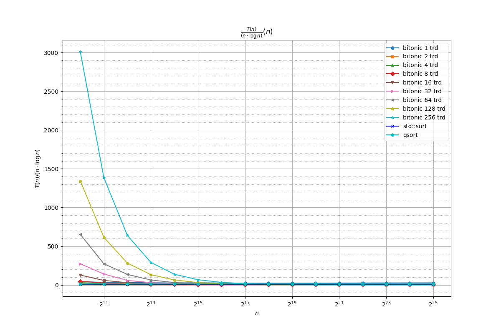
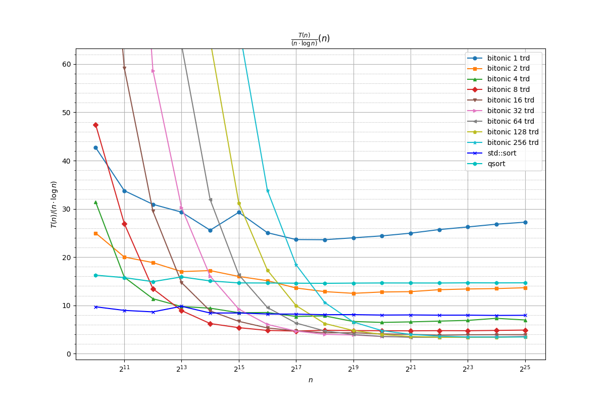
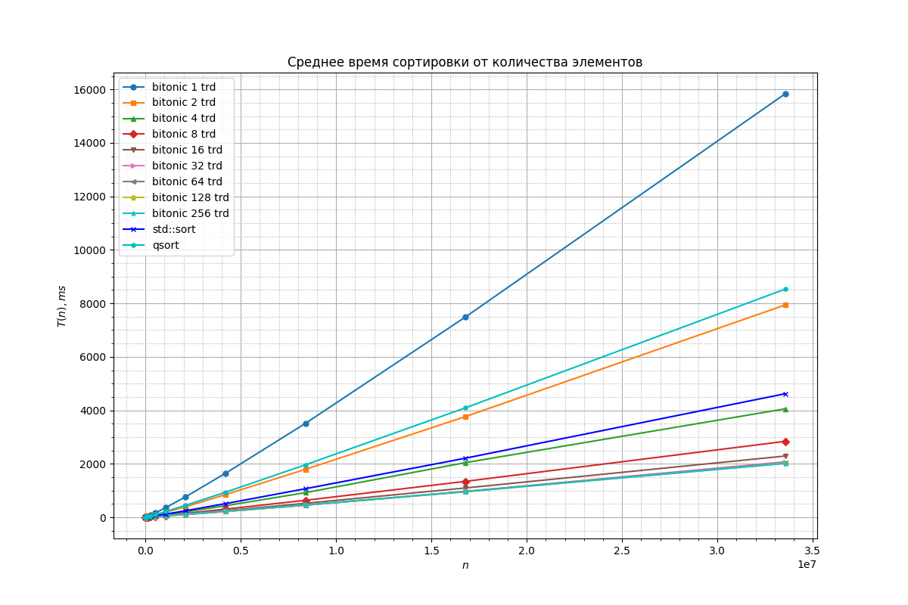
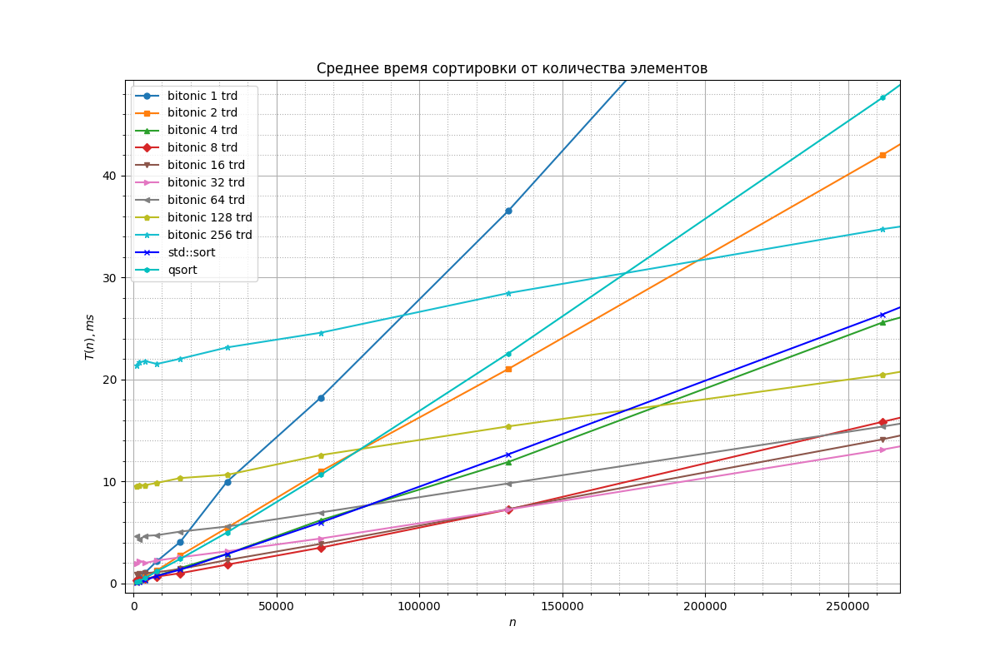

# Bitonic sort on cpu via pthread lib


## Disclaimer
The author realizes the irrationality of the project. \
It is created with "pthread" requirements for "parallel programming" course at MIPT. \
Bitonic sort algorithm was chosen for that task by me.

## Research
Algorithm was benchmarked on my machine:
```
System:
  Kernel: 6.8.0-58-generic arch: x86_64 bits: 64 compiler: gcc v: 13.3.0
  Desktop: Cinnamon v: 6.2.9 Distro: Linux Mint 22 Wilma
    base: Ubuntu 24.04 noble
CPU:
  Info: 8-core (4-mt/4-st) model: 13th Gen Intel Core i5-13420H bits: 64
    type: MST AMCP arch: Raptor Lake rev: 2 cache: L1: 704 KiB L2: 7 MiB
    L3: 12 MiB
Info:
  Memory: total: 16 GiB

! turboboost OFF
! governor performance
! fixed CPU frequency 3400 MHz
```
### Logarithmic x axis

Normalized by O(n*logn) graphs. \
Assume T(n) = K(n) * n * log(n). \
So here are __graphics for K(n) multiplier.__
<tr>
Graphics represent that bitonic sort is faster than std::sort only for bigger arrays.
For my configuration it has no sense to create more than 32 threads.

__Bitonic ~2 times faster.__





### Linear x axis

From these graphics we can get approximate time of creating a thread. \
__22 ms / 256 threads = 0.9 ms__




## Getting and building
```
git clone https://github.com/2APetrin/pthread_bitonic_sort.git
cd pthread_bitonic_sort/
cmake -B build
cd build
make
```

* `generative_test`
is for runtime generation of sorted sequence. It was benchmarked for research with `--gtest_repeat=10`

* `sanity_test` simple static tests
* `bitonic_sort`: gets
    1. number of threads [should be power of 2]
    2. path to file with int sequence [number of elements sould be power of 2] \
    example: \
    `./bitonic_sort 2 ../test/data/data00.in`